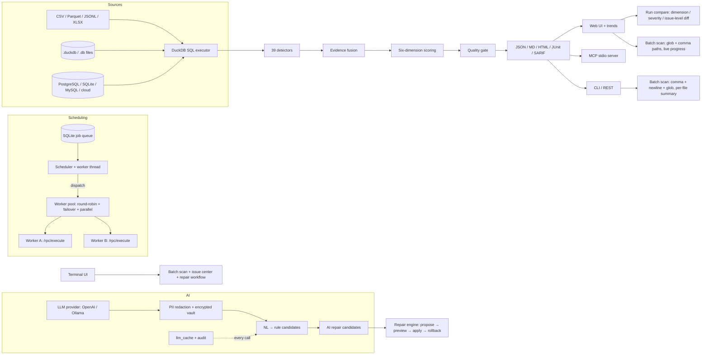

<p align="center">
  
</p>

<h1 align="center">DataSentry</h1>

<p align="center">
  <b>Evidence-driven, local-first AI copilot for data quality.</b><br>
  Detect · Explain · Validate · Repair — with statistical evidence, AI assistance, and human approval.
</p>

<p align="center">
  
  
  
  
  
  
  
</p>

---

> **中文导读**：DataSentry 是一个以统计证据为基础、以 AI 为辅助、以人工审批为保障的本地优先数据质量平台。
> 一次扫描生成六维质量评分，每个问题带证据链；自然语言即可提出规则与修复方案，但**只有人工批准才生效**。
> 数据不出机器（LLM 可接本地 Ollama），DuckDB 执行引擎，百万行 10 秒级。

## Try it in 3 commands

```bash
pip install datasentry-ai
datasentry scan orders.csv                      # detect → fuse → score → persist
datasentry issues list --severity high          # each issue with samples + ratios + confidence
```

<p align="center">
  
</p>

## What is DataSentry?

DataSentry scans your data (CSV / Parquet / JSONL / XLSX / DuckDB / SQLite / PostgreSQL / MySQL / cloud objects on s3:// gs:// az://) and produces:

- **39 evidence-driven detectors** — missingness, dates, encodings, cross-field rules, cross-table foreign keys, duplicates, outlier models — every issue carries samples, ratios, and confidence.
- **Six-dimension quality score** — completeness, validity, uniqueness, consistency, integrity, timeliness, with explainable weights.
- **Repair loop with human approval** — propose → preview → apply (copy + rollback artifact) → verify → rollback. AI suggests; you decide.
- **Drift engine** — compare historical scans: schema, row-count, score and issue-distribution drift.
- **Quality gates in CI** — `scan --fail-on` blocks releases; export JSON / Markdown / HTML / JUnit / SARIF.
- **LLM assistance, safely** — NL → rule/repair candidates with preflight; PII redacted into an encrypted vault; every call audited.
- **Cron scheduling + distributed execution** — SQLite job queue, webhooks, quality gates, change-aware skip; `datasentry worker` nodes with pool routing, failover and parallel dispatch.
- **Multiple surfaces** — CLI, REST API, Web UI with trends, and an MCP stdio server (24 tools) for LLM agents.

<p align="center">
  
</p>

> **Live demo report** — [orders-report.html](docs/demo/orders-report.html) (200 rows with 15 injected quality issues)

## Quick start

```bash
pip install datasentry-ai     # or: uv sync (source checkout)

datasentry                     # interactive terminal UI (TUI): dashboard / scan / issues / repair
datasentry scan orders.csv               # detect → fuse → score → persist
datasentry scan "a.csv, b.csv, data/*.csv"  # batch scan (comma/newline separated, globs)
datasentry issues list                   # issues by severity / dimension
datasentry score                         # six-dimension score of the latest scan
datasentry repair propose <issue_id> --file orders.csv   # fix proposal (apply = copy + rollback artifact)
datasentry repair verify <run_id>        # re-scan the repaired copy; CI gate (exit 0 = no regression)
datasentry drift latest orders           # drift between the two latest scans
datasentry-server                       # Web UI + REST API at http://localhost:8000
```

Every CLI command stays available for scripts and CI; `datasentry scan` streams
live detector progress to stderr so stdout stays clean JSON. Connectors include
DuckDB/SQLite tables (`--table`), MySQL, PostgreSQL (DSN via env or `secrets`,
never logged), and cloud objects (credentials from env / `secrets`).

## Architecture



- **Local-first**: DuckDB executes everything; LLM is optional (auto-degrades when unconfigured) and can run on local Ollama so data never leaves the machine.
- **Deterministic core**: detectors, scoring and repair are pure statistics — no AI guesswork in detection.
- **Human in the loop**: rules and repairs are proposals until you approve them; every repair is fingerprinted and rollback-able.

## The repair loop (scan → propose → apply → verify → rollback)

Available identically on **CLI, Web UI, REST and MCP** — batchable, audit-friendly, and the
source file is **never overwritten** (each apply writes a repaired copy + `before` snapshot):

```bash
datasentry repair propose-batch <run_id> --file data.csv --all    # read-only
datasentry repair apply-batch  <run_id> --file data.csv --all     # issues without a proposal skip, not fail
datasentry repair verify       <run_id>                           # re-scan copy: fixed/persistent/new types
datasentry repair diff         <run_id>                           # changed rows: line + col: old -> new
datasentry repair rollback     <run_id>                           # restore the snapshot
```

Batch commands exit `0` on full success, `4` on partial failure (each failure under
`errors` in the JSON envelope — add `--format json` to machine-read it).

**Verify is the gate**: `repair verify` exits 0 unless the repair introduced a regression
(`--require-clean` demands zero remaining issues); the Web artifact page
(`/ui/repairs/{id}/artifact`) shows the before/after row diff, and the compare view
links every FIXED group back to the repair that fixed it. Same report over REST
(`POST /repairs/{id}/verify`, `GET /repairs/{id}/diff`) and MCP (`repair_verify`).

## Features

| Area | What you get |
|------|--------------|
| Detection | 39 detectors across 6 dimensions; SQL-pushdown single-table; plugin API (`plugins/` auto-load, SHA-256 integrity locks) |
| Scoring | 0–100 six-dimension score, severity normalization, contract criticality |
| Contracts | YAML contract DSL → validation + gate + Pandera / Great Expectations export |
| Repair | trim / normalize case / replace missing token / set null / clip values; preview re-runs rules; verify + diff on 4 surfaces |
| Drift | schema / row-count / score / issue-distribution signals between historical scans |
| AI | NL→rules with preflight + approval gate; AI repair candidates with locked operation surface; PII vault + key rotation |
| Scheduling | cron jobs, manual triggers, run history, webhooks, quality gates, change-aware skip |
| Distributed | `datasentry worker` nodes; pool routing with failover + cooldown + health checks; parallel dispatch |
| Interfaces | CLI · REST API · Web UI (`/ui`, `/ui/scans`, `/ui/trends`, `/ui/compare`, `/ui/repairs`) · MCP stdio (24 tools) |
| Engineering | 11-stage CI, wheel build + isolated install smoke, 1e6-row benchmark gate |

## Documentation & blog

- [docs/DEVELOPMENT.md](docs/DEVELOPMENT.md) — development notes, conventions
- [docs/00-设计裁决记录-ADR.md](docs/00-设计裁决记录-ADR.md) — 110+ ADRs
- [Detect → fix → verify: the data quality loop](.growth/blog-3-repair-loop-en.md) / [中文版](.growth/blog-3-repair-loop-zh.md)
- [Verifying the fix: four ways to prove a repair worked](.growth/blog-4-verify-loop-en.md) / [中文版](.growth/blog-4-verify-loop-zh.md)

## Development

```bash
uv sync
make check          # ruff + mypy --strict + pytest with 85% coverage gate
make demo           # demo script
make bench          # 1e6-row benchmark (60s gate)
make build          # build both wheels (datasentry + datasentry_core)
```

## Contributing

- Report issues with the exact data shape (or a minimal CSV) and the command you ran.
- Code: add a detector → register it in `build_initial_detectors` → cover it in `tests/` → `make check`.
- Please keep the **human-in-the-loop** invariant: anything AI proposes must remain a proposal until a human approves it.

## License

Apache-2.0 — see [LICENSE](LICENSE).