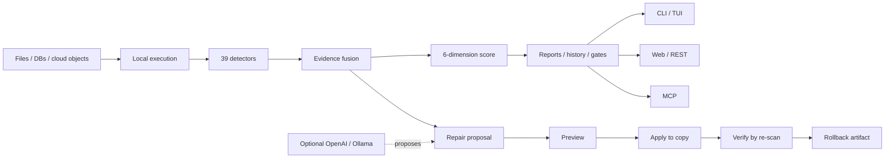

<!-- mcp-name: io.github.jackxiaozhiren/datasentry -->

<p align="center">
  
</p>

<h1 align="center">DataSentry</h1>

<p align="center">
  <strong>Find bad data before your users do.</strong><br>
  Automatic data-quality discovery, evidence-backed explanations, and safe reversible repair.<br>
  <strong>Local-first. Deterministic by default. AI optional.</strong>
</p>

<p align="center">
  <a href="https://jackxiaozhiren.github.io/datasentry/">Live demo</a> ·
  <a href="#try-it-in-30-seconds">30-second start</a> ·
  <a href="examples/">Examples</a> ·
  <a href="docs/MCP.md">MCP setup</a> ·
  <a href="CONTRIBUTING.md">Contribute</a>
</p>

<p align="center">
  
  
  
  
  
</p>

<p align="center">
  
</p>

> **中文导读**：DataSentry 会先自动发现数据质量问题，再给出样本、比例、置信度等证据。修复采用 `propose → preview → apply to a copy → verify → rollback` 的保守流程。检测与评分不依赖 LLM，AI 只作为可选辅助，数据可以完全留在本机。

## Try it in 30 seconds

Install the current PyPI release and run the zero-config product tour:

```bash
pip install --upgrade datasentry-ai
datasentry demo
```

`datasentry-demo` is also available as a direct console alias.

The demo generates synthetic dirty data, runs the built-in detectors, exports JSON + HTML reports, applies one safe repair to a copy, re-scans the repaired copy, and prints a rollback command. It needs no dataset, cloud service, API key, or LLM.

```text
synthetic dirty CSV
        ↓
39 deterministic detectors
        ↓
evidence-backed issues + quality score
        ↓
preview → repaired copy
        ↓
re-scan → verify new/persistent issues
```

Prefer scanning your own data immediately?

```bash
curl -L https://raw.githubusercontent.com/Jackxiaozhiren/datasentry/main/demo-data/orders.csv -o orders.csv
datasentry scan orders.csv
datasentry issues list --severity high
```

Or launch the interactive interfaces:

```bash
datasentry          # terminal UI
datasentry-server   # Web UI + REST API at http://localhost:8000/ui/
```

## Why DataSentry exists

Most data-quality tools are excellent once you already know the expectations, checks, or contracts you want to enforce. Real incidents often start one step earlier: **you do not yet know what is wrong.**

DataSentry is built around the complete remediation loop:

```text
Find → Explain → Fix safely → Verify
```

- **Find** — discover common quality problems without writing every rule first.
- **Explain** — attach samples, affected counts/ratios, detector evidence, and confidence.
- **Fix safely** — preview changes and apply repairs to a copy instead of mutating the source.
- **Verify** — re-scan the repaired copy and surface persistent or newly introduced issues.

## What it catches automatically

DataSentry ships with **39 deterministic detectors** covering common failure modes such as:

- missing and placeholder values;
- invalid emails, URLs, dates, and encodings;
- duplicate identifiers and uniqueness violations;
- inconsistent categories and cross-field contradictions;
- foreign-key and referential-integrity problems;
- numeric and statistical outliers;
- schema, row-count, score, and issue-distribution drift.

Every scan produces an evidence-backed issue list and a six-dimension quality score across completeness, validity, uniqueness, consistency, integrity, and timeliness.

## Safe repair, not blind mutation

```bash
# inspect the highest-severity findings
datasentry issues list --severity high

# propose a repair without changing data
datasentry repair propose <issue_id> --file orders.csv

# preview the exact effect
datasentry repair preview <issue_id> --file orders.csv

# apply to a repaired copy; the original is not overwritten
datasentry repair apply <issue_id> --file orders.csv

# re-scan the repaired copy and detect regressions
datasentry repair verify <run_id>

# inspect or undo the repair
datasentry repair diff <run_id>
datasentry repair rollback <run_id>
```

Repairs are fingerprinted, auditable, and reversible. AI-generated repair proposals remain human-approved state changes.

## Pick your workflow

| Goal | Start here |
|---|---|
| See the complete zero-config product tour | `datasentry demo` |
| Explore a dirty CSV locally | `datasentry scan data.csv` |
| Block bad data in GitHub Actions | [`examples/integrations/github-actions/`](examples/integrations/github-actions/) |
| Add quality gates to dbt / Airflow | [`examples/integrations/`](examples/integrations/) |
| Review issues in a terminal | `datasentry` |
| Review issues in a browser / REST API | `datasentry-server` |
| Give AI agents deterministic quality tools | [`docs/MCP.md`](docs/MCP.md) |
| Browse all runnable examples | [`examples/`](examples/) |

### Quality gates for CI

```bash
datasentry scan orders.csv --fail-on high
```

For GitHub repositories, reuse DataSentry's maintained `workflow_call` gate instead of duplicating installation and exit-code handling:

```yaml
jobs:
  datasentry:
    uses: Jackxiaozhiren/datasentry/.github/workflows/datasentry-quality-gate.yml@main
    with:
      path: data/orders.csv
      fail_on: high
```

See [`docs/GITHUB_ACTIONS.md`](docs/GITHUB_ACTIONS.md) for inputs, artifacts, security boundaries, and version-pinning guidance.

Reports can be exported as JSON, Markdown, HTML, JUnit, and SARIF. The GitHub Actions example fails the workflow on severe findings while still uploading an HTML report for review.

## Give AI agents deterministic data-quality tools

DataSentry includes an MCP stdio server:

```bash
datasentry mcp --project /path/to/project
```

MCP-capable clients can scan files, inspect evidence-backed issues, read quality scores and trends, compare drift, validate contracts, manage scheduled jobs, and call DataSentry tools without bypassing the same underlying safety rules used by the CLI and REST API.

Copy-paste setup recipes for **VS Code** and **Claude Desktop** are in [`docs/MCP.md`](docs/MCP.md).

> **Boundary:** AI may propose; humans approve state-changing repairs.

## How it differs from popular data-quality projects

This is a positioning guide, not a winner/loser feature scorecard. These projects solve overlapping but different jobs; check their upstream documentation for current capabilities.

| Project | Core mental model | A strong fit when you want... |
|---|---|---|
| **DataSentry** | discover → explain → repair → verify | automatic issue discovery plus a controlled, reversible remediation loop |
| [Great Expectations](https://github.com/great-expectations/great_expectations) | Expectations / expressive data tests | explicit validation rules, validation results, and generated data-quality documentation |
| [Soda Core](https://github.com/sodadata/soda-core) | data contracts and quality checks | YAML contracts and verification across a broad data stack |
| [Deequ](https://github.com/awslabs/deequ) | “unit tests for data” on Spark | large-scale data verification in Spark-centric environments |
| [fg-data-profiling](https://github.com/Data-Centric-AI-Community/ydata-profiling) | one-line profiling / EDA | fast exploratory profiling and shareable analysis reports |

DataSentry is intentionally not trying to replace a metadata catalog, lineage platform, or every validator. Its focus is narrower: **find bad data, show why it was flagged, and close the repair loop without gambling on the source.**

## Local-first by design

- deterministic detection and scoring run locally;
- DuckDB powers core local execution;
- OpenAI/Ollama assistance is optional;
- PII redaction, encrypted mappings, and LLM audit records are available when AI is enabled;
- the original source file is not overwritten by repair workflows.

## Data sources

- CSV, Parquet, JSONL, XLSX
- DuckDB and SQLite
- PostgreSQL and MySQL
- `s3://`, `gs://`, and `az://` objects
- single files, batches, and globs

## History and drift

Persist scans and compare data over time:

```bash
datasentry drift latest orders
datasentry score
```

Tracked signals include schema changes, row-count movement, quality-score changes, and issue-distribution drift.

## Architecture



## Reproducible benchmark

```bash
uv sync
uv run python benchmarks/bench_scan.py 1000000 42
```

The benchmark generates synthetic dirty data and measures profiling, detection/fusion/scoring, numeric-outlier detection, JSONL reading, sampling, score drift, and memory high-water marks. See [`docs/BENCHMARKS.md`](docs/BENCHMARKS.md).

## Development

```bash
uv sync
make check          # lint + mypy --strict + tests/coverage
make demo           # exercise the public datasentry demo path
make bench          # benchmark
make build          # distributions
```

## Contributing

Useful contributions include new detectors, connectors, integration examples, reproducible benchmark cases, documentation/translations, minimal bug reproductions, and CLI/TUI/Web usability improvements.

See [`CONTRIBUTING.md`](CONTRIBUTING.md), [`CODE_OF_CONDUCT.md`](CODE_OF_CONDUCT.md), [`SECURITY.md`](SECURITY.md), and [`ROADMAP.md`](ROADMAP.md). Small contributions are tracked with **`good first issue`** and **`help wanted`** labels.

## Documentation

- [Project site and live report](https://jackxiaozhiren.github.io/datasentry/)
- [`examples/`](examples/) — scenario-first runnable examples
- [`docs/MCP.md`](docs/MCP.md) — VS Code and Claude Desktop MCP setup
- [`docs/GITHUB_ACTIONS.md`](docs/GITHUB_ACTIONS.md) — reusable GitHub quality gate
- [`examples/integrations/github-actions/`](examples/integrations/github-actions/) — copy-paste CI gate
- [`docs/BENCHMARKS.md`](docs/BENCHMARKS.md) — benchmark policy
- [`docs/DEVELOPMENT.md`](docs/DEVELOPMENT.md) — engineering notes
- [Detect → fix → verify](.growth/blog-3-repair-loop-en.md) / [中文版](.growth/blog-3-repair-loop-zh.md)

## License

Apache-2.0 — see [`LICENSE`](LICENSE).

---

<p align="center">
  If DataSentry helps you catch bad data before it reaches production, consider giving the repository a ⭐.<br>
  It helps other data engineers discover the project.
</p>
