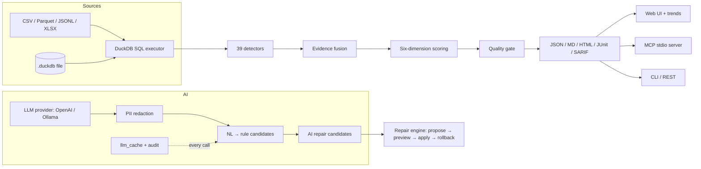

<p align="center">
  
</p>

<h1 align="center">DataSentry</h1>

<p align="center">
  <b>Evidence-driven, local-first AI copilot for data quality.</b><br>
  Detect · Explain · Validate · Repair — with statistical evidence, AI assistance, and human approval.
</p>

<p align="center">
  
  
  
  
  
  
</p>

---

> **中文导读**：DataSentry 是一个以统计证据为基础、以 AI 为辅助、以人工审批为保障的本地优先数据质量平台。
> 一次扫描生成六维质量评分，每个问题带证据链；自然语言即可提出规则与修复方案，但**只有人工批准才生效**。
> 数据不出机器（LLM 可接本地 Ollama），DuckDB 执行引擎，百万行 10 秒级。

## What is DataSentry?

DataSentry scans your data (CSV / Parquet / JSONL / XLSX / DuckDB) and produces:

- **39 evidence-driven detectors** — missingness, dates, encodings, cross-field rules, cross-table foreign keys, duplicates (exact + fuzzy), outlier models (Isolation Forest / LOF), and more. Every issue carries a statistical evidence chain: samples, ratios, confidence.
- **Six-dimension quality score** — completeness, validity, uniqueness, consistency, integrity, timeliness — with explainable weights and per-dimension contributions.
- **Repair loop with human approval** — propose → preview (rule re-run before/after) → apply (fingerprinted copy + rollback artifact) → rollback. AI suggests; you decide.
- **Drift engine** — compare historical scans: schema, row-count, score and issue-distribution drift.
- **Quality gates in CI** — `scan --fail-on` blocks releases by severity or score; export reports as JSON / Markdown / HTML / JUnit / SARIF.
- **LLM assistance, safely** — natural language → rule candidates with preflight simulation; PII redacted before any prompt; every call audited (`llm status`).
- **Multiple surfaces** — CLI, REST API, server-rendered Web UI with cross-scan trends, and an MCP stdio server so LLM agents can use the tools directly.

<p align="center">
  
</p>

> **Live demo report** — [orders-report.html](docs/demo/orders-report.html) (200 rows with 15 injected quality issues)

## Quick start

```bash
pip install datasentry        # or: uv sync (source checkout)

datasentry scan orders.csv               # detect → fuse → score → persist, one step
datasentry issues list                   # issues by severity / dimension
datasentry score <run_id>                # six-dimension quality score
datasentry repair propose <issue_id> --file orders.csv   # fix proposal
datasentry drift latest orders           # drift between the two latest scans
datasentry-server                       # Web UI + REST API at http://localhost:8000
```

Scan a DuckDB file (optional — any CSV/Parquet/JSONL/XLSX works):

```bash
datasentry scan analytics.duckdb --table payments
```

Contract-driven scanning (optional):

```bash
datasentry contract validate contract.yaml
datasentry contract export contract.yaml --as pandera   # or --as ge
datasentry scan orders.csv --contract contract.yaml     # gate + rules bound
```

## Architecture



- **Local-first**: DuckDB executes everything; LLM is optional (auto-degrades when unconfigured) and can run on local Ollama so data never leaves the machine.
- **Deterministic core**: detectors, scoring and repair are pure statistics — no AI guesswork in detection.
- **Human in the loop**: rules and repairs are proposals until you approve them; every repair is fingerprinted and rollback-able.

## Features

| Area | What you get |
|------|--------------|
| Detection | 39 detectors across 6 dimensions; SQL-pushdown single-table; plugin API (`plugins/` auto-load) |
| Scoring | 0–100 six-dimension score, ADR-003 severity normalization, contract criticality |
| Contracts | YAML contract DSL → validation + gate + Pandera / Great Expectations export |
| Repair | trim / normalize case / replace missing token / set null / clip values; preview re-runs rules |
| Drift | schema / row-count / score / issue-distribution signals between historical scans |
| AI | NL→rules with preflight + approval gate; AI repair candidates with locked operation surface |
| Interfaces | CLI · REST API · Web UI (`/ui`, `/ui/trends`) · MCP stdio (7 tools) |
| Engineering | 11-stage CI, wheel build + isolated install smoke, 1e6-row benchmark gate |

## Documentation

| Doc | Content |
|-----|---------|
| [docs/DEVELOPMENT.md](docs/DEVELOPMENT.md) | Full development notes, per-step decisions and conventions |
| [docs/00-设计裁决记录-ADR.md](docs/00-设计裁决记录-ADR.md) | 46 architecture decision records (design rationale) |
| [docs/01-一致性检查.md](docs/01-设计材料-一致性检查.md) | Spec consistency checks |
| [docs/03-MVP-V1-划分.md](docs/03-设计材料-MVP-V1-划分.md) | MVP vs V1 feature scoping |

## Development

```bash
uv sync
make check          # ruff + mypy --strict + pytest with 85% coverage gate
make demo           # M9 demo script
make bench          # 1e6-row benchmark (60s gate)
make build          # build both wheels (datasentry + datasentry_core)
```

Requirements: Python ≥ 3.12, [uv](https://docs.astral.sh/uv/). CI validates lint, types, coverage, demo, benchmark, API/UI smoke and wheel installability on every push.

## Contributing

- Report issues with the exact data shape (or a minimal CSV) and the command you ran.
- Code: add a detector → register it in `build_initial_detectors` → cover it in `tests/` → `make check`.
- Every change should reference its ADR decision; see [docs/DEVELOPMENT.md](docs/DEVELOPMENT.md) for conventions.
- Please keep the **human-in-the-loop** invariant: anything AI proposes must remain a proposal until a human approves it.

## License

Apache-2.0 — see [LICENSE](LICENSE).
