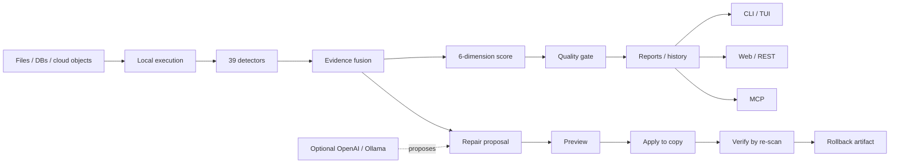

<p align="center">
  
</p>

<h1 align="center">DataSentry</h1>

<p align="center">
  <strong>Automatically find, explain, and safely fix bad data.</strong><br>
  A local-first data quality copilot with deterministic detection, evidence-backed issues,
  and human-approved reversible repairs.
</p>

<p align="center">
  <a href="https://jackxiaozhiren.github.io/datasentry/">Live demo</a> ·
  <a href="#quick-start">Quick start</a> ·
  <a href="#why-datasentry">Why DataSentry</a> ·
  <a href="ROADMAP.md">Roadmap</a> ·
  <a href="CONTRIBUTING.md">Contribute</a>
</p>

<p align="center">
  
  
  
  
  
  
</p>

<p align="center">
  
</p>

> **中文导读**：DataSentry 自动发现数据质量问题，给出样本、比例和置信度等证据，再生成可预览、可验证、可回滚的修复方案。检测核心不依赖 LLM；AI 只负责辅助规则与修复建议，是否执行由人决定。数据可完全留在本机。

## The data quality loop

```text
Detect  →  Explain  →  Repair  →  Verify
  │           │           │          │
39 detectors  evidence     preview    re-scan
              samples      copy       regression gate
              ratios       rollback
              confidence
```

Most data-quality failures are not hard because a check cannot be written. They are hard because you first have to discover the problem, understand whether it is real, fix it without damaging the source, and prove the fix did not introduce a regression.

DataSentry is built around that complete loop.

## Quick start

```bash
pip install datasentry-ai

datasentry scan orders.csv
datasentry issues list --severity high
```

Start the interactive terminal UI with:

```bash
datasentry
```

Or launch the Web UI and REST API:

```bash
datasentry-server
# http://localhost:8000/ui/
```

## Why DataSentry?

### 1. Discover problems before you know which rules to write

DataSentry ships with **39 evidence-driven detectors** for missingness, invalid values, dates, encodings, duplicates, cross-field rules, foreign keys, and statistical outliers. A scan produces a six-dimension quality score across completeness, validity, uniqueness, consistency, integrity, and timeliness.

### 2. Evidence first, AI second

Detection and scoring are deterministic. Every issue can carry samples, ratios, and confidence so you can inspect *why* it was raised. LLMs are optional and are never the authority deciding whether data is valid.

### 3. Repair without gambling on the source file

The repair workflow is deliberately conservative:

```text
propose → preview → apply to a copy → verify → rollback if needed
```

The original file is never overwritten. Repair runs are fingerprinted and auditable, and verification re-scans the repaired copy to surface fixed, persistent, and newly introduced problems.

### 4. Keep sensitive data local

DuckDB executes the core scan locally. LLM assistance is optional and can use a local Ollama provider. When an LLM is used, DataSentry includes PII redaction, an encrypted vault, and audit records for calls.

## What it can scan

- CSV, Parquet, JSONL, XLSX
- DuckDB and SQLite
- PostgreSQL and MySQL
- Cloud objects on `s3://`, `gs://`, and `az://`
- Single files or batch paths/globs

## Safe repair workflow

```bash
# 1) inspect issues
datasentry issues list --severity high

# 2) generate a proposal (read-only)
datasentry repair propose <issue_id> --file orders.csv

# 3) apply to a repaired copy
datasentry repair apply <repair_id>

# 4) prove the repair did not regress quality
datasentry repair verify <repair_id>

# 5) inspect the row-level change or roll back
datasentry repair diff <repair_id>
datasentry repair rollback <repair_id>
```

Batch repair commands are also available for scan-wide workflows.

## Quality gates for CI

Use DataSentry as a release gate instead of only as an interactive profiler:

```bash
datasentry scan orders.csv --fail-on high
```

Reports can be exported as JSON, Markdown, HTML, JUnit, and SARIF, making the same evidence usable by humans, CI systems, and code-scanning surfaces.

## Drift and history

Persisted scans let DataSentry compare datasets over time:

```bash
datasentry drift latest orders
datasentry score
```

Tracked signals include schema changes, row-count changes, quality-score movement, and issue-distribution drift.

## Use DataSentry with AI agents

DataSentry includes an MCP stdio server that exposes the same underlying SDK used by the CLI and REST API.

```bash
datasentry mcp
```

This lets MCP-capable agents scan files, inspect issues, read quality scores and trends, compare drift, validate contracts, manage scheduled jobs, and invoke other DataSentry tools without bypassing the project's safety invariants.

The important boundary remains the same: **AI may propose; humans approve state-changing repairs.**

## Interfaces

| Surface | Best for |
|---|---|
| CLI / TUI | local exploration, scripts, repair workflows |
| REST API | application and service integration |
| Web UI | issue review, reports, trends, comparisons, repair workbench |
| MCP stdio | AI-agent workflows |
| Exporters | JSON, Markdown, HTML, JUnit, SARIF |

## Reproducible performance benchmark

Performance claims should be reproducible, not just quoted. The repository includes a benchmark that generates synthetic dirty data and measures profiling, full detection/fusion/scoring, numeric-outlier detection, JSONL reading, sampling, score drift, and memory high-water marks.

```bash
uv sync
uv run python benchmarks/bench_scan.py 1000000 42
# optional sampling benchmark
uv run python benchmarks/bench_scan.py 1000000 42 --sampling-size 200000
```

The acceptance and optimization budgets are encoded directly in `benchmarks/bench_scan.py`, so results can be compared on your own hardware instead of relying on an unspecified machine. See [`docs/BENCHMARKS.md`](docs/BENCHMARKS.md) for the reporting format and benchmark policy.

## Architecture



### Core invariants

- **Local-first** — the deterministic core runs locally; cloud LLMs are optional.
- **Deterministic detection** — AI is not used to decide whether the base detectors fire.
- **Evidence-backed issues** — findings are designed to be inspectable, not opaque scores.
- **Human-in-the-loop repair** — state-changing AI suggestions require approval.
- **Reversible changes** — repair applies to a copy and creates rollback artifacts.

## Engineering

```bash
uv sync
make check          # lint + mypy --strict + pytest/coverage gate
make demo           # reproducible demo
make bench          # performance benchmark
make build          # build distributions
```

The project uses strict typing, automated CI, regression tests, reproducible benchmark gates, and architecture decision records for load-bearing design choices.

## Where DataSentry fits

DataSentry is a good fit when you want **automatic issue discovery plus a controlled remediation loop** in one local-first tool.

If your only requirement is enforcing a small set of already-known contracts, a dedicated rule-first validator may be simpler. If you need a full enterprise metadata catalog, DataSentry is intentionally not trying to replace one. The project focuses on finding bad data, explaining the evidence, and closing the repair loop safely.

## Roadmap

The public roadmap is maintained in [`ROADMAP.md`](ROADMAP.md). Near-term priorities emphasize adoption and integration as much as new detectors: broader Python compatibility evaluation, GitHub Actions, reproducible benchmark reporting, dbt/Airflow examples, connectors, and community plugins.

## Contributing

Contributions do not need to start with core engine code. Useful first contributions include:

- new detectors with focused tests;
- connectors and integration examples;
- reproducible benchmark cases;
- documentation and translations;
- bug reproductions using minimal synthetic data;
- usability improvements to CLI/TUI/Web workflows.

See [`CONTRIBUTING.md`](CONTRIBUTING.md), [`CODE_OF_CONDUCT.md`](CODE_OF_CONDUCT.md), and [`SECURITY.md`](SECURITY.md).

If you are looking for a small first contribution, check issues labeled **`good first issue`** or **`help wanted`**.

## Documentation

- [Project site and live report](https://jackxiaozhiren.github.io/datasentry/)
- [`docs/BENCHMARKS.md`](docs/BENCHMARKS.md) — benchmark policy and reproducibility
- [`docs/DEVELOPMENT.md`](docs/DEVELOPMENT.md) — detailed engineering notes
- [`docs/00-设计裁决记录-ADR.md`](docs/00-设计裁决记录-ADR.md) — architecture decision records
- [Detect → fix → verify](.growth/blog-3-repair-loop-en.md) / [中文版](.growth/blog-3-repair-loop-zh.md)
- [Verifying a repair](.growth/blog-4-verify-loop-en.md) / [中文版](.growth/blog-4-verify-loop-zh.md)

## License

Apache-2.0 — see [`LICENSE`](LICENSE).

---

<p align="center">
  If DataSentry helped you catch bad data before it reached production, consider giving the repository a ⭐.<br>
  It helps other data engineers discover the project.
</p>
